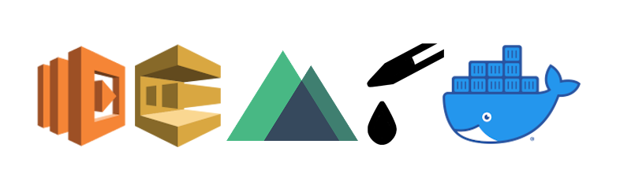

# Serverless Mailing App



## Requirements

* Docker
* Docker Compose

## Install

```bash
git clone git@github.com:kpicaza/sl-mailing-list.git app
cd app
docker-compose build
```

## Run HTTP server

```bash
docker-compose up 
```
Then open your browser at [http://127.0.0.1](http://127.0.0.1) to see the Nuxt app, and open [http://127.0.0.1/api/v1/](http://127.0.0.1/api/v1/) for Antidot Framework API  .

## Run PHP

```bash
docker-compose run --rm backend_php php -v 
```

## Run Composer

```bash
docker-compose run --rm backend_php composer 
```

## Run backend CLI

```bash
docker-compose run --rm backend_php bin/console 
```

## Run Node 

```bash
docker-compose run --rm node --version 
```

## Run Yarn 

```bash
docker-compose run --rm node yarn --version 
```
